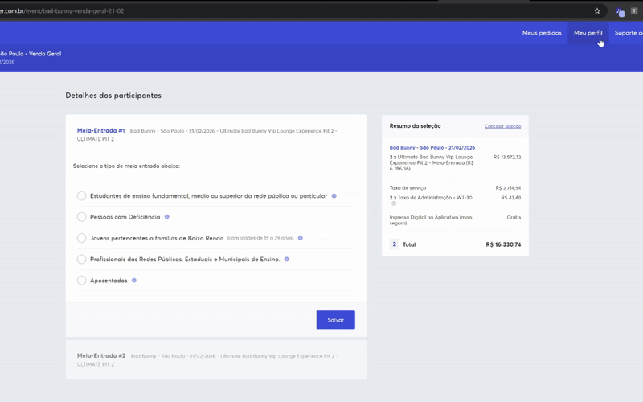
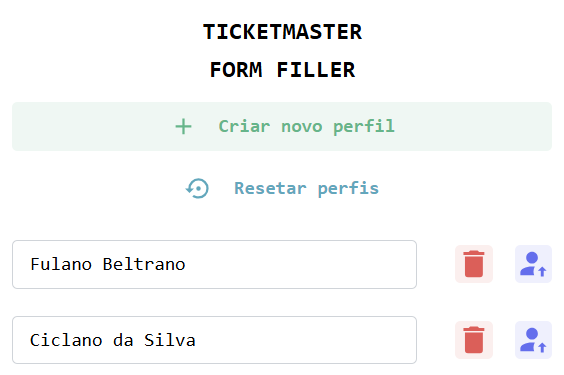
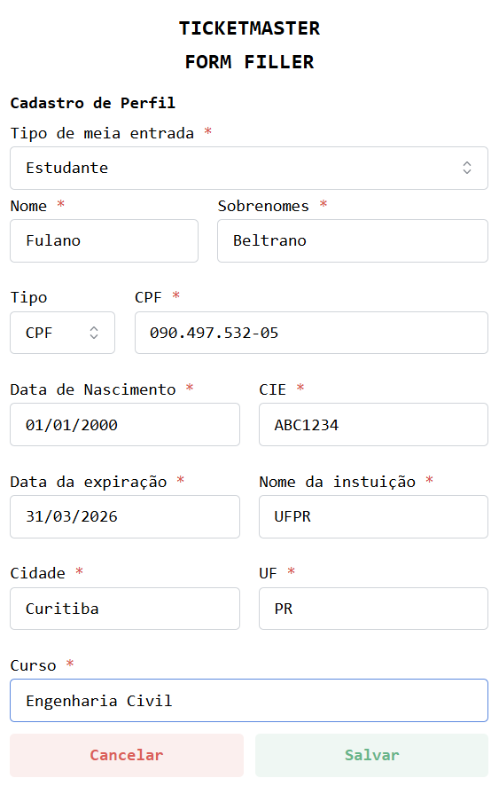

# Ticketmaster Form Filler
This Chrome extension is designed to streamline the ticket purchasing process on Ticketmaster. By allowing users to predefine multiple profiles that mirror the site's ticket holder form fields, the extension will quickly fill out the necessary information during checkout. This helps the user to save  time and significantly increase their chances of securing high-demand tickets.



## Key Features
🔃 **Multiple Profiles:** Create and manage multiple profiles with pre-filled data matching the ticket holder form requirements.

🎯 **Quick Selection:** Easily choose which profile to use to fill out the form on the ticket page.

⚡ **Faster Checkout:** Fills out the form fields in a split second, giving you an edge in time-sensitive ticket releases.

<div style="display: flex; width: 100%; justify-content: space-between">
  
  
</div>


<br/>


## Installation 
#### Clone this repository
```
  git clone https://github.com/leoandretta/ticketmaster-form-filler.git ticketmaster-form-filler
```
#### Open the project directory
```
  cd ticketmaster-form-filler
```
#### Install Dependencies
```
  npm install
```

## Load the Extension
1. Run the build command `npm run build`
2. Navigate to `chrome://extensions/` in your Chrome browser
3. At the top right corner of the page, enable "Developer Mode"
4. Click "Load Unpacked".
5. Navigate to your project's "dist" folder and select that and hit OK.
